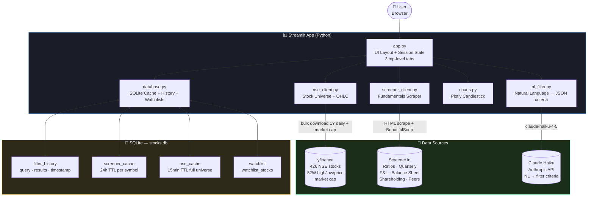

<div align="center">

# 📈 Stock Market Dashboard

### AI-Powered Indian Stock Screener — Natural Language Filters, Watchlists, Live Charts & Screener.in Fundamentals

[](https://python.org)
[](https://streamlit.io)
[](https://anthropic.com)
[](https://pypi.org/project/yfinance)
[](https://plotly.com)
[](https://sqlite.org)
[](https://share.streamlit.io)

<div align="center">

| 📊 Universe | 🎯 Near 52W High | ⚡ NL Filter | ⭐ Watchlists | 💰 Running Cost |
|:---:|:---:|:---:|:---:|:---:|
| **426 NSE stocks** | **auto-filtered** | **Claude Haiku** | **multi-list** | **~$1–3 / month** |

</div>

A personal stock research dashboard for Indian markets — type what you want in plain English, get a filtered list of NSE stocks, and click any stock to see its full fundamental profile: key ratios, candlestick chart (daily/weekly), quarterly results, annual P&L, balance sheet, cash flow, shareholding pattern, and peer comparison — all sourced from Screener.in.

</div>

---

## 🎯 The Problem

Researching Indian stocks typically means juggling three or four tabs:

- **Screener.in** for fundamentals and historical financials
- **NSE/BSE** for live prices and 52-week data
- **TradingView** or Moneycontrol for charts
- A notebook to track which stocks you already looked at

**This dashboard collapses all of that into one screen**, with a persistent natural-language filter, a watchlist system, and query history that remembers every filter you've ever run.

---

## ✨ Features

### 📈 Screener Tab
- **426-stock universe** — Nifty 50 + Next 50 + Midcap 150 + Smallcap 250 via yfinance
- **Default view** — stocks within 5% of their 52-week high, sorted nearest-to-high first
- **Natural language filter** — type in plain English, Claude Haiku converts it to filter criteria
- **Stock search** — real-time filter by symbol or company name above the stock list
- **Save as Watchlist** — save any filtered result to a named watchlist with one click
- **Market cap filtering** — `market_cap_cr` column enables large/mid/small-cap NL queries

### ⭐ Watchlists Tab
- Create multiple named watchlists
- Add any stock via the **⭐ Watchlist** popover in the stock detail header
- Remove individual stocks inline (✕ button per stock)
- Delete an entire watchlist
- Watchlist stocks show live price and % change

### 📋 Filter History Tab
- Every NL query is saved with its result symbols and timestamp
- **Replay** any past filter with one click
- **Save as Watchlist** directly from any history entry

### Stock Detail (right panel)
- **Key Ratios** — Market Cap, P/E, Book Value, ROCE, ROE, ROCE/ROE 5Yr/10Yr, Industry PE, Current Discount, Sales Growth variants, Debt/Equity, and more
- **Candlestick chart** — Daily (1Y, 6M) and Weekly (2Y, 5Y) with volume subplot and 52W high/low markers
- **Financial tabs** — Quarterly Results, Profit & Loss, Balance Sheet, Cash Flow
- **Shareholding Pattern** — Promoters, FIIs, DIIs, Public across quarterly periods
- **Peer Comparison** — side-by-side metrics for sector peers
- **Direct link** to Screener.in consolidated page

---

## 🖥️ Dashboard Layout

```
📈 Stock Market Dashboard
┌─────────────────────────────────────────────────────────────────┐
│  [📈 Screener]  [⭐ Watchlists]  [📋 Filter History]            │
├──────────────────┬──────────────────────────────────────────────┤
│  FILTER          │  BAJFINANCE          ₹936  -2.02%  [⭐ WL ▼] │
│  [NL query box]  │  52W High: ₹1,102   Low: ₹788               │
│  [Run] [52W Hi]  ├──────────────────────────────────────────────┤
│  [💾 Save as WL] │  KEY RATIOS                                  │
│                  │  Mkt Cap  │ P/E    │ Book Value              │
│  🔍 Symbol/Name  │  ROCE     │ ROE    │ ROCE 5Yr               │
│  ─────────────  │  ROE 5Yr  │ Ind PE │ Current Discount        │
│  STOCKS (48)    │  Sales Gr  │ D/E    │ ...                    │
│  ADANIPORTS     ├──────────────────────────────────────────────┤
│  APOLLOHOSP     │  CHART  [Daily 1Y][Daily 6M][Wkly 2Y][5Y]   │
│  BAJFINANCE ✓  │  ┌──────────────────────────────────────────┐ │
│  GRASIM         │  │  candlestick + volume + 52W markers      │ │
│  ...            │  └──────────────────────────────────────────┘ │
│                 ├──────────────────────────────────────────────┤
│                 │ [Quarterly][P&L][BS][CF][Shareholding][Peers] │
│                 │  Promoters  51.88% 51.88% 50.10% ...        │
│                 │  FIIs       11.58% 11.25% 16.02% ...        │
└─────────────────┴──────────────────────────────────────────────┘
```

---

## 🏗️ Architecture



### Data Flow

1. **On startup** — `nse_client.py` runs `yfinance.download()` for all 426 symbols in one bulk call, fetches market cap via `fast_info` (parallel, 30 workers), computes `pct_from_52wk_high`, and caches in SQLite for 15 minutes.
2. **Default view** — stocks where `pct_from_52wk_high ≤ 5%` sorted nearest-to-high first (typically 40–80 stocks).
3. **Natural language filter** — query goes to Claude Haiku with a structured system prompt; Claude returns JSON filter criteria (including market cap size filters); criteria applied to the in-memory DataFrame; query + result symbols persisted to `filter_history`.
4. **Stock click** — `screener_client.py` fetches `screener.in/company/{SYMBOL}/consolidated/`, parses all HTML sections (ratios, quarterly, P&L, balance sheet, cash flow, shareholding, peers), caches for 24 hours.
5. **Chart** — `yfinance.Ticker.history()` with selected period/interval, rendered as a dark-themed Plotly candlestick with volume subplot and 52W high/low reference lines.
6. **Watchlists** — stored in SQLite (`watchlist` + `watchlist_stocks` tables); stocks fetched from the live universe on view.

---

## 💼 Why This Exists

| Before | After |
|---|---|
| Open 4 tabs (Screener, NSE, TradingView, notes) | Single dashboard — everything in one screen |
| Manually scan 500 stocks for 52W high candidates | Auto-filtered to ~50 stocks within 5% of high |
| Write Python scripts to filter by ratios | Type in plain English — Claude does the parsing |
| Lose filter history between sessions | All queries + results persisted in SQLite |
| No way to track stocks of interest | Named watchlists — add manually or save a filter |
| Stuck to your laptop | Deployed on Streamlit Cloud — access from anywhere |

### Key Metrics

- 📊 **Universe:** 426 NSE stocks (Nifty 50 + Next 50 + Midcap 150 + Smallcap 250 selection)
- ⚡ **Data refresh:** Universe cached 15 min, fundamentals cached 24h — no redundant scraping
- 🧠 **Filter cost:** ~$0.001–0.002 per Claude Haiku query (< $3/month at 30 queries/day)
- 📈 **Chart modes:** Daily (1Y, 6M) and Weekly (2Y, 5Y) with volume and 52W markers
- ⭐ **Watchlists:** Unlimited named watchlists, persisted in SQLite
- 💾 **Storage:** SQLite — zero infrastructure, works locally and on Streamlit Cloud

---

## 🛠️ Tech Stack

| Layer | Technology | Purpose |
|---|---|---|
| **UI** | Streamlit 1.35 | Dashboard layout, tabs, session state, dark theme |
| **Charts** | Plotly 5.18 | Candlestick + volume subplots |
| **Stock Data** | yfinance 1.3 | Bulk OHLCV download + market cap for NSE universe (`.NS` suffix) |
| **Fundamentals** | requests + BeautifulSoup4 + lxml | Screener.in HTML scraping |
| **AI Filter** | Claude Haiku 4.5 via Anthropic SDK | NL query → JSON filter criteria |
| **Persistence** | SQLite (stdlib) | Filter history, screener cache, NSE price cache, watchlists |
| **Config** | python-dotenv | Local `.env` + Streamlit Cloud `st.secrets` |

---

## 🚀 Getting Started

### Prerequisites
- Python 3.10+
- An [Anthropic API key](https://console.anthropic.com) (for AI filtering — optional; the 52W High view works without it)

### 1. Clone & Install

```bash
git clone https://github.com/DevMLAI01/stock-market-dashboard.git
cd stock-market-dashboard
pip install -r requirements.txt
```

### 2. Configure Environment

```bash
cp .env.example .env
# Edit .env — add your Anthropic API key
```

```env
ANTHROPIC_API_KEY=sk-ant-...
```

### 3. Run

```bash
streamlit run app.py
```

Open [http://localhost:8501](http://localhost:8501). The dashboard loads with ~426 NSE stocks and auto-filters to those near their 52-week high. First load takes ~3–5 minutes (yfinance bulk download + parallel market cap fetch); subsequent loads are instant from cache.

---

## ☁️ Deploy to Streamlit Cloud

### 1. Fork or push to GitHub

The repo is already public at [github.com/DevMLAI01/stock-market-dashboard](https://github.com/DevMLAI01/stock-market-dashboard).

### 2. Deploy

1. Go to [share.streamlit.io](https://share.streamlit.io)
2. Sign in with GitHub
3. **New app** → Repository: `DevMLAI01/stock-market-dashboard` → Branch: `master` → Main file: `app.py`
4. Click **Deploy**

### 3. Add API key as a secret

In your deployed app → ⋮ → **Settings** → **Secrets**:

```toml
ANTHROPIC_API_KEY = "sk-ant-your-key-here"
```

Your dashboard is now accessible from any browser, any device. Streamlit Cloud auto-redeploys on every push to `master`.

---

## 📁 Project Structure

```
stock-market-dashboard/
├── app.py                      # Streamlit entry point — 3-tab layout, all UI components
├── requirements.txt
├── .env.example                # ANTHROPIC_API_KEY placeholder
├── .streamlit/
│   └── config.toml             # Dark theme + server settings for Streamlit Cloud
├── src/
│   ├── __init__.py
│   ├── nse_client.py           # yfinance bulk download, NSE_UNIVERSE dict (426 stocks),
│   │                           # parallel market cap fetch, get_historical_ohlc()
│   ├── screener_client.py      # Screener.in HTML scraper — ratios, quarterly, P&L,
│   │                           # balance sheet, cash flow, shareholding, peers
│   ├── database.py             # SQLite: filter_history, screener_cache, nse_cache,
│   │                           # watchlist, watchlist_stocks — full CRUD helpers
│   ├── nl_filter.py            # Claude Haiku: NL query → filter_spec JSON → applied to DataFrame
│   └── charts.py               # Plotly candlestick + volume chart with 52W high/low markers
└── data/
    └── stocks.db               # Auto-created SQLite database (gitignored)
```

---

## 🔬 How the Natural Language Filter Works

The system prompt constrains Claude to **only use columns available in the NSE DataFrame**:

```
Columns: symbol, name, last_price, year_high, year_low,
         pct_change (today's % move), pct_from_high (% below 52W high),
         market_cap_cr (market cap in Indian Crores)

Return JSON:
{
  "filters": [{"column": "...", "operator": "gt|lt|gte|lte|eq|contains", "value": ...}],
  "sort_by": "column_name",
  "sort_ascending": true,
  "summary": "one sentence description"
}
```

**Example queries that work:**

| Query | What Claude generates |
|---|---|
| `"stocks within 2% of 52-week high"` | `pct_from_high lte 2` |
| `"stocks up more than 1% today"` | `pct_change gt 1` |
| `"large cap stocks"` | `market_cap_cr gt 20000` |
| `"mid cap stocks near their high"` | `market_cap_cr gte 5000` + `market_cap_cr lte 20000` + `pct_from_high lte 5` |
| `"stocks AT their 52-week high"` | `pct_from_high lte 0.1` |
| `"show me the biggest losers today"` | `sort by pct_change ascending` |

> **Fundamental filters** (P/E, ROE, ROCE) require per-stock Screener.in data which isn't available in bulk — Claude notes this and filters on what's available in the universe DataFrame.

Every query is saved to `filter_history` with its result symbols and timestamp, and can be replayed or saved as a watchlist from the **Filter History** tab.

---

## 🗺️ Roadmap

- [ ] **Price alerts** — notify when a stock crosses its 52W high
- [ ] **Bulk fundamentals** — background job to pre-fetch Screener.in data for all filtered stocks
- [ ] **Fundamental NL filters** — enable P/E, ROE, ROCE filtering by caching ratios in SQLite
- [ ] **Export** — download filtered list or watchlist as CSV with key ratios
- [ ] **Compare mode** — overlay two stocks on the same chart
- [ ] **Add more indices** — Nifty Bank, Nifty IT, Nifty Pharma sector filters
- [ ] **Technical indicators** — EMA 20/50/200, RSI overlay on chart
- [ ] **Agentic filter** — multi-step Claude agent with tools for price, sector, and fundamental filtering

---

## 📄 License

MIT © [DevMLAI01](https://github.com/DevMLAI01)

---

<div align="center">

Built with ❤️ using [Claude AI](https://anthropic.com) · [Streamlit](https://streamlit.io) · [yfinance](https://pypi.org/project/yfinance) · [Screener.in](https://screener.in)

</div>
