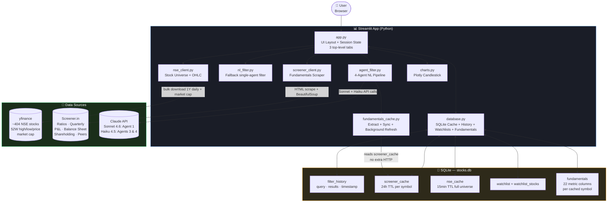

<div align="center">

# 📈 Stock Market Dashboard

### AI-Powered Indian Stock Screener — Multi-Agent NL Filters, Watchlists, Live Charts & Screener.in Fundamentals

[](https://python.org)
[](https://streamlit.io)
[](https://anthropic.com)
[](https://pypi.org/project/yfinance)
[](https://plotly.com)
[](https://sqlite.org)
[](https://share.streamlit.io)

<div align="center">

| 📊 Universe | 🎯 Near 52W High | ⚡ NL Filter | ⭐ Watchlists | 💰 Running Cost |
|:---:|:---:|:---:|:---:|:---:|
| **~404 NSE stocks** | **auto-filtered** | **4-Agent Pipeline** | **multi-list** | **~$2–5 / month** |

</div>

A personal stock research dashboard for Indian markets — type any financial question in plain English and get a filtered list of NSE stocks. A four-agent AI pipeline understands your intent, checks what data is available, applies the filter, and validates the results. Click any stock to see its full profile: key ratios, candlestick chart, quarterly results, P&L, balance sheet, cash flow, shareholding pattern, and peer comparison — all from Screener.in.

</div>

---

## 🎯 The Problem

Researching Indian stocks typically means juggling three or four tabs:

- **Screener.in** for fundamentals and historical financials
- **NSE/BSE** for live prices and 52-week data
- **TradingView** or Moneycontrol for charts
- A notebook to track which stocks you already looked at

**This dashboard collapses all of that into one screen**, with a persistent natural-language filter, a watchlist system, and query history that remembers every filter you've ever run.

---

## ✨ Features

### 📈 Screener Tab
- **~404-stock universe** — Nifty 50 + Next 50 + Midcap 150 + Smallcap 250 via yfinance
- **Default view** — stocks within 5% of their 52-week high, sorted nearest-to-high first
- **Multi-agent NL filter** — type any financial question; a 4-agent Claude pipeline handles intent, data enrichment, filtering, and validation
- **29 filterable columns** — price data (always available) + 21 fundamental/shareholding columns (populated as stocks are viewed)
- **Stock search** — real-time filter by symbol or company name
- **Agent reasoning expander** — see what each agent decided, with per-column coverage stats
- **Coverage indicator + 🔄 button** — shows how many stocks have fundamental data; manually trigger a full background fetch
- **Save as Watchlist** — save any filtered result to a named watchlist

### ⭐ Watchlists Tab
- Create multiple named watchlists
- Add any stock via the **⭐ Watchlist** popover in the stock detail header
- Remove individual stocks inline (✕ button per stock)
- Delete an entire watchlist
- Watchlist stocks show live price and % change

### 📋 Filter History Tab
- Every NL query is saved with its result symbols and timestamp
- **Replay** any past filter with one click
- **Save as Watchlist** directly from any history entry

### Stock Detail (right panel)
- **Key Ratios** — Market Cap, P/E, Book Value, ROCE, ROE, ROCE/ROE 5Yr/10Yr, Industry PE, Current Discount, Sales Growth variants, Debt/Equity, and more
- **Candlestick chart** — Daily (1Y, 6M) and Weekly (2Y, 5Y) with volume subplot and 52W high/low markers
- **Financial tabs** — Quarterly Results, Profit & Loss, Balance Sheet, Cash Flow
- **Shareholding Pattern** — Promoters, FIIs, DIIs, Public across quarterly periods
- **Peer Comparison** — side-by-side metrics for sector peers
- **Direct link** to Screener.in consolidated page

---

## 🖥️ Dashboard Layout

```
📈 Stock Market Dashboard
┌─────────────────────────────────────────────────────────────────┐
│  [📈 Screener]  [⭐ Watchlists]  [📋 Filter History]            │
├──────────────────┬──────────────────────────────────────────────┤
│  FILTER          │  BAJFINANCE          ₹936  -2.02%  [⭐ WL ▼] │
│  [NL query box]  │  52W High: ₹1,102   Low: ₹788               │
│  [Run] [52W Hi]  ├──────────────────────────────────────────────┤
│  🧠 46/404  [🔄] │  KEY RATIOS                                  │
│  ▸ Agent steps   │  Mkt Cap  │ P/E    │ Book Value              │
│  [💾 Save as WL] │  ROCE     │ ROE    │ ROCE 5Yr               │
│                  │  ROE 5Yr  │ Ind PE │ Current Discount        │
│  🔍 Symbol/Name  │  Sales Gr  │ D/E    │ ...                    │
│  ─────────────  ├──────────────────────────────────────────────┤
│  STOCKS (48)    │  CHART  [Daily 1Y][Daily 6M][Wkly 2Y][5Y]   │
│  ADANIPORTS     │  ┌──────────────────────────────────────────┐ │
│  APOLLOHOSP     │  │  candlestick + volume + 52W markers      │ │
│  BAJFINANCE ✓  │  └──────────────────────────────────────────┘ │
│  GRASIM         ├──────────────────────────────────────────────┤
│  ...            │ [Quarterly][P&L][BS][CF][Shareholding][Peers] │
│                 │  Promoters  51.88% 51.88% 50.10% ...        │
│                 │  FIIs       11.58% 11.25% 16.02% ...        │
└─────────────────┴──────────────────────────────────────────────┘
```

---

## 🤖 How the Multi-Agent Filter Works

Every natural language query runs through a **4-agent pipeline**, each agent specialised for its task:

```
User Query
    │
    ▼
Agent 1 — Query Analyst  (Claude Sonnet 4.6 + tool use)
    Uses get_column_info() tool to inspect live column coverage.
    Returns: {can_filter, required_columns, needs_enrichment, reasoning}
    │
    ▼
Agent 2 — Data Enricher  (pure Python, no LLM)
    If shareholding/extended columns are needed, re-syncs from screener_cache.
    Returns: (enriched_df, coverage_report with per-column warnings)
    │
    ▼
Agent 3 — Filter Builder  (Claude Haiku 4.5)
    Receives confirmed columns + coverage. Builds dynamic system prompt.
    Returns: (filtered_df, filter_spec JSON)
    │
    ▼
Agent 4 — Validator  (Claude Haiku 4.5)
    Checks result count + sample rows + coverage warnings.
    Returns: {summary, caveat, confidence: high|medium|low}
    │
    ▼
Result  →  Streamlit session state + filter_history SQLite
```

**Model assignment rationale:**
- **Agent 1 uses Sonnet 4.6** — this is the reasoning bottleneck: it must understand ambiguous financial queries, map them to columns, and detect unanswerable questions. Sonnet's stronger instruction-following and tool-use accuracy justify the cost.
- **Agents 3 & 4 use Haiku 4.5** — structured JSON generation and sanity-checking with fully-specified prompts. Haiku handles these fast and cheap.
- **Agent 2 is pure Python** — no model needed; it's data plumbing (SQLite reads + DataFrame merges).

### Filterable Columns

| Group | Columns | Coverage |
|---|---|---|
| **Price / Market** | `last_price`, `year_high`, `year_low`, `pct_change`, `pct_from_high`, `market_cap_cr` | 100% always |
| **Fundamentals** | `pe_ratio`, `roce`, `roe`, `book_value`, `debt_equity`, `dividend_yield`, `sales_growth_5yr`, `profit_growth_yoy`, `revenue_growth_yoy` | Grows as stocks are clicked |
| **Extended** | `opm_pct`, `opm_quarterly_pct`, `net_profit_margin`, `sales_growth_3yr`, `price_to_book`, `eps_growth_3yr`, `free_cash_flow`, `pledged_pct` | Grows as stocks are clicked |
| **Shareholding** | `promoter_pct`, `fii_pct`, `dii_pct`, `public_pct` | Grows as stocks are clicked |

Coverage builds automatically: every stock click fetches and caches its Screener.in data, which the next filter run picks up. The 🔄 button triggers a background fetch for all ~404 stocks at once (~3 min).

### Example Queries

| Query | What the pipeline does |
|---|---|
| `"stocks within 2% of 52-week high"` | Agent 1: `pct_from_high` (price group, 100% coverage) → Agent 3: `pct_from_high lte 2` |
| `"FII holding above 20%"` | Agent 1: `fii_pct`, needs enrichment → Agent 2: re-syncs shareholding data → Agent 3: `fii_pct gt 20` → Agent 4: warns if coverage < 60% |
| `"operating margin above 25%"` | Agent 1: `opm_pct`, needs enrichment → Agent 2: re-syncs extended metrics → Agent 3: `opm_pct gt 25` |
| `"large cap with YoY profit growth above 20%"` | Multi-column: `market_cap_cr gt 20000` + `profit_growth_yoy gt 20` |
| `"low debt companies, D/E below 0.5"` | `debt_equity lt 0.5` |
| `"promoter holding above 60%"` | `promoter_pct gt 60` |
| `"show me the biggest losers today"` | Sort by `pct_change` ascending |

Every query is saved to `filter_history` with its result symbols and timestamp.

---

## 🏗️ Architecture



### Data Flow

1. **On startup** — `nse_client.py` bulk-downloads 1Y daily OHLC for all symbols via yfinance, fetches market cap in parallel (30 workers), and caches the universe in SQLite for 15 minutes. Simultaneously, `fundamentals_cache.py` re-syncs all existing `screener_cache` entries into the `fundamentals` table (instant, no HTTP), then starts a background daemon to fetch the remaining stocks from Screener.in at 0.5s/stock (~3 min for the full universe).
2. **Default view** — stocks where `pct_from_high ≤ 5%` sorted nearest-to-high first (typically 40–80 stocks).
3. **NL filter** — query enters the 4-agent pipeline. Agent 1 inspects live column coverage via tool use. Agent 2 re-syncs extended metrics from cache if needed. Agent 3 generates a JSON filter spec from confirmed columns. Agent 4 validates results and surfaces coverage caveats. The enriched DataFrame is a LEFT JOIN of the NSE universe and the `fundamentals` table — NaN for uncached stocks means fundamental filters naturally exclude them.
4. **Stock click** — `screener_client.py` fetches `screener.in/company/{SYMBOL}/consolidated/`, parses all HTML sections, caches for 24 hours. The cached data is immediately extracted into the `fundamentals` table so it becomes available for future NL filters.
5. **Chart** — `yfinance.Ticker.history()` with selected period/interval, rendered as a dark-themed Plotly candlestick with volume subplot and 52W high/low reference lines.
6. **Watchlists** — stored in SQLite (`watchlist` + `watchlist_stocks` tables); live prices fetched from the cached universe on view.

---

## 💼 Why This Exists

| Before | After |
|---|---|
| Open 4 tabs (Screener, NSE, TradingView, notes) | Single dashboard — everything in one screen |
| Manually scan 500 stocks for 52W high candidates | Auto-filtered to ~50 stocks within 5% of high |
| Can only filter by price — not by FII%, margin, growth | 29 filterable columns including shareholding and P&L metrics |
| Write Python scripts to filter by ratios | Type in plain English — 4-agent Claude pipeline handles it |
| Lose filter history between sessions | All queries + results persisted in SQLite |
| No way to track stocks of interest | Named watchlists — add manually or save a filter |

### Key Metrics

- 📊 **Universe:** ~404 NSE stocks (Nifty 50 + Next 50 + Midcap 150 + Smallcap 250)
- ⚡ **Data refresh:** Universe cached 15 min, fundamentals cached 24h
- 🧠 **Filter cost:** Agent 1 (Sonnet): ~$0.003–0.006/query · Agents 3+4 (Haiku): ~$0.001 total · ~$3–8/month at 30 queries/day
- 📈 **Chart modes:** Daily (1Y, 6M) and Weekly (2Y, 5Y) with volume and 52W markers
- ⭐ **Watchlists:** Unlimited named watchlists, persisted in SQLite
- 💾 **Storage:** SQLite — zero infrastructure, works locally and on Streamlit Cloud

---

## 🛠️ Tech Stack

| Layer | Technology | Purpose |
|---|---|---|
| **UI** | Streamlit 1.35 | Dashboard layout, tabs, session state, dark theme |
| **Charts** | Plotly 5.18 | Candlestick + volume subplots |
| **Stock Data** | yfinance 1.3 | Bulk OHLCV download + market cap for NSE universe (`.NS` suffix) |
| **Fundamentals** | requests + BeautifulSoup4 + lxml | Screener.in HTML scraping |
| **AI Filter — Agent 1** | Claude Sonnet 4.6 + tool use | Query understanding, column discovery, intent classification |
| **AI Filter — Agents 3 & 4** | Claude Haiku 4.5 | Filter spec generation and result validation |
| **Persistence** | SQLite (stdlib) | Filter history, screener cache, NSE price cache, watchlists, fundamentals |
| **Config** | python-dotenv | Local `.env` + Streamlit Cloud `st.secrets` |

---

## 🚀 Getting Started

### Prerequisites
- Python 3.10+
- An [Anthropic API key](https://console.anthropic.com) (for AI filtering — optional; the 52W High view works without it)

### 1. Clone & Install

```bash
git clone https://github.com/DevMLAI01/stock-market-dashboard.git
cd stock-market-dashboard
pip install -r requirements.txt
```

### 2. Configure Environment

```bash
cp .env.example .env
# Edit .env — add your Anthropic API key
```

```env
ANTHROPIC_API_KEY=sk-ant-...
```

### 3. Run

```bash
streamlit run app.py
```

Open [http://localhost:8501](http://localhost:8501). The dashboard loads with ~404 NSE stocks and auto-filters to those near their 52-week high. First load takes ~3–5 minutes (yfinance bulk download + parallel market cap fetch); subsequent loads are instant from cache. Fundamentals are fetched in the background — the coverage counter in the left panel updates as data comes in.

---

## ☁️ Deploy to Streamlit Cloud

### 1. Fork or push to GitHub

The repo is public at [github.com/DevMLAI01/stock-market-dashboard](https://github.com/DevMLAI01/stock-market-dashboard).

### 2. Deploy

1. Go to [share.streamlit.io](https://share.streamlit.io)
2. Sign in with GitHub
3. **New app** → Repository: `DevMLAI01/stock-market-dashboard` → Branch: `master` → Main file: `app.py`
4. Click **Deploy**

### 3. Add API key as a secret

In your deployed app → ⋮ → **Settings** → **Secrets**:

```toml
ANTHROPIC_API_KEY = "sk-ant-your-key-here"
```

Your dashboard is now accessible from any browser, any device. Streamlit Cloud auto-redeploys on every push to `master`.

---

## 📁 Project Structure

```
stock-market-dashboard/
├── app.py                      # Streamlit entry point — 3-tab layout, all UI components
├── requirements.txt
├── .env.example                # ANTHROPIC_API_KEY placeholder
├── TEST_REPORT.md              # End-to-end QA test report (34 tests)
├── .streamlit/
│   └── config.toml             # Dark theme + server settings for Streamlit Cloud
├── src/
│   ├── __init__.py
│   ├── nse_client.py           # yfinance bulk download, NSE_UNIVERSE dict (~404 stocks),
│   │                           # parallel market cap fetch, get_historical_ohlc()
│   ├── screener_client.py      # Screener.in HTML scraper — ratios, quarterly, P&L,
│   │                           # balance sheet, cash flow, shareholding, peers
│   ├── database.py             # SQLite: filter_history, screener_cache, nse_cache,
│   │                           # watchlist, watchlist_stocks, fundamentals (22 columns)
│   ├── nl_filter.py            # Single-agent fallback filter (Claude Haiku)
│   ├── agent_filter.py         # 4-agent NL pipeline: Analyst → Enricher → Builder → Validator
│   ├── fundamentals_cache.py   # extract_metrics(), sync_from_screener_cache(),
│   │                           # start_full_universe_refresh(), is_refresh_running()
│   └── charts.py               # Plotly candlestick + volume chart with 52W high/low markers
└── data/
    └── stocks.db               # Auto-created SQLite database (gitignored)
```

---

## 🗺️ Roadmap

- [x] **Multi-agent NL filter** — 4-agent pipeline with intent analysis, data enrichment, and result validation
- [x] **Extended fundamentals** — FII %, promoter %, DII %, OPM, net profit margin, 3yr sales CAGR, and more
- [x] **Shareholding pattern tab** — Promoters, FIIs, DIIs, Public across quarterly periods
- [x] **Full universe background fetch** — all ~404 stocks pre-fetched at startup
- [x] **Watchlists** — create, manage, and save filtered results as watchlists
- [x] **Filter history tab** — replay any past query or save its results as a watchlist
- [ ] **Price alerts** — notify when a stock crosses its 52W high
- [ ] **Export** — download filtered list or watchlist as CSV with key ratios
- [ ] **Compare mode** — overlay two stocks on the same chart
- [ ] **Technical indicators** — EMA 20/50/200, RSI overlay on chart
- [ ] **Sector filters** — Nifty Bank, Nifty IT, Nifty Pharma universe subsets

---

## 📄 License

MIT © [DevMLAI01](https://github.com/DevMLAI01)

---

<div align="center">

Built with ❤️ using [Claude AI](https://anthropic.com) · [Streamlit](https://streamlit.io) · [yfinance](https://pypi.org/project/yfinance) · [Screener.in](https://screener.in)

</div>
